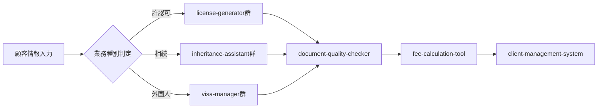

# 行政書士向け包括的スキル集 構想書

## 概要
行政書士の業務全般をカバーする、体系的なAgent Skillsコレクションの構築提案

## 行政書士の主要業務領域

### 1. 許認可申請業務
行政書士の中核業務。各種事業の許可・認可・届出・登録申請

### 2. 権利義務・事実証明書類作成
契約書、協議書、内容証明、各種証明書類の作成

### 3. 会社設立・法人関連業務
株式会社、合同会社、NPO法人等の設立支援

### 4. 相続・遺言関連業務
遺産分割協議書、遺言書作成支援、相続手続き

### 5. 外国人関連業務
在留資格申請、帰化申請、国際業務

### 6. 自動車関連業務
車庫証明、自動車登録、運送業許可

### 7. 土地利用・農地関連業務
農地転用、開発許可申請

## 現在のスキルカバレッジ分析

### 既存スキル（3個）
1. **license-application-generator** ✅
   - カバー領域: 許認可申請（建設業、飲食業、古物商）
   - カバー率: 許認可全体の約20%

2. **contract-template-generator** ✅
   - カバー領域: 契約書作成
   - カバー率: 権利義務書類の約30%

3. **company-formation-kit** ✅
   - カバー領域: 会社設立
   - カバー率: 法人設立業務の約40%

### ギャップ分析
- 相続・遺言: 0%カバー
- 外国人関連: 0%カバー
- 自動車関連: 0%カバー
- 土地利用: 0%カバー
- 許認可の80%が未カバー

## 包括的スキル集の提案

### Phase 1: コア業務の完全カバー（優先度: 高）

#### 1-1. 許認可申請の拡充
```yaml
新規スキル:
  - medical-license-generator      # 医療・介護系許可
    対象: 薬局開設、介護事業所、医療機器販売
    
  - transport-license-generator    # 運送・物流系許可
    対象: 一般貨物自動車運送、倉庫業、旅行業
    
  - environment-permit-generator   # 環境・廃棄物系許可
    対象: 産業廃棄物処理業、リサイクル業
    
  - education-license-generator    # 教育・保育系許可
    対象: 学習塾、保育園、各種学校
```

#### 1-2. 相続・遺言スキルパック
```yaml
新規スキル:
  - inheritance-division-assistant  # 遺産分割協議書作成
    機能: 相続人調査、財産目録作成、協議書生成
    
  - will-drafting-assistant        # 遺言書作成支援
    機能: 自筆証書遺言、公正証書遺言の下書き
    
  - inheritance-procedure-guide    # 相続手続きナビゲーター
    機能: 必要書類チェック、手続きフロー管理
```

#### 1-3. 外国人関連業務スキル
```yaml
新規スキル:
  - visa-application-manager       # 在留資格申請管理
    対象: 就労ビザ、配偶者ビザ、永住申請
    
  - naturalization-assistant      # 帰化申請支援
    機能: 要件チェック、書類作成、動機書サポート
    
  - international-marriage-kit    # 国際結婚手続き
    機能: 各国別必要書類、翻訳サポート
```

### Phase 2: 専門業務の効率化（優先度: 中）

#### 2-1. 自動車関連スキル
```yaml
新規スキル:
  - vehicle-registration-system   # 自動車登録一括処理
  - parking-certificate-generator # 車庫証明申請
  - transport-business-license    # 運送業許可申請
```

#### 2-2. 土地・農地関連スキル
```yaml
新規スキル:
  - farmland-conversion-assistant # 農地転用申請
  - development-permit-generator  # 開発許可申請
  - land-use-analyzer            # 土地利用規制チェック
```

### Phase 3: 付加価値サービス（優先度: 中〜低）

#### 3-1. 業務管理・効率化ツール
```yaml
新規スキル:
  - client-management-system      # 顧客管理システム
  - deadline-tracking-calendar    # 期限管理カレンダー
  - fee-calculation-tool         # 報酬自動計算
  - document-version-control     # 書類バージョン管理
```

#### 3-2. コンプライアンス・品質管理
```yaml
新規スキル:
  - legal-update-monitor         # 法改正モニタリング
  - document-quality-checker     # 書類品質チェッカー
  - ethics-compliance-guide      # 倫理規定遵守ガイド
```

## スキル間の連携構想

### 統合ワークフロー例


### データ共有とAPI連携
- 共通顧客データベース
- 書類テンプレート共有
- 法令データベースAPI
- 電子申請システム連携

## 実装優先順位マトリクス

| スキル分類 | 需要 | 実装難易度 | ROI | 優先度 |
|-----------|------|-----------|-----|--------|
| 許認可拡充 | 高 | 中 | 高 | 1 |
| 相続・遺言 | 高 | 低 | 高 | 1 |
| 外国人関連 | 中 | 高 | 中 | 2 |
| 自動車関連 | 中 | 低 | 中 | 2 |
| 業務管理 | 高 | 中 | 高 | 2 |
| 土地・農地 | 低 | 高 | 低 | 3 |

## 期待される効果

### 定量的効果
- 業務カバー率: 30% → 90%
- 平均業務時間: 60% 削減
- エラー率: 80% 削減
- 月間処理件数: 3倍増

### 定性的効果
- ワンストップサービスの実現
- 業務品質の標準化
- 新人教育の効率化
- 顧客満足度の向上

## 実装ロードマップ

### Year 1: 基盤構築
- Q1: 許認可申請の拡充（4スキル）
- Q2: 相続・遺言パック（3スキル）
- Q3: 外国人関連基本（3スキル）
- Q4: 業務管理ツール（2スキル）

### Year 2: 拡張と統合
- Q1-Q2: 自動車・土地関連
- Q3-Q4: システム統合、API開発

### Year 3: 最適化と展開
- AI機能の高度化
- 他士業との連携
- SaaS化検討

## 技術スタック提案

### コア技術
- フレームワーク: Next.js / React
- バックエンド: Node.js / Python
- データベース: PostgreSQL
- AI/ML: OpenAI API, Claude API

### 統合技術
- API Gateway: Kong / AWS API Gateway
- 認証: Auth0 / Firebase Auth
- ストレージ: AWS S3 / Google Cloud Storage
- 電子申請: e-Gov API連携

## 次のアクション

1. **優先スキルの詳細設計**
   - inheritance-division-assistant
   - medical-license-generator
   - visa-application-manager

2. **共通基盤の設計**
   - データモデル統一
   - APIインターフェース定義
   - セキュリティポリシー策定

3. **パイロットプロジェクト**
   - 1-2個の新規スキルを試作
   - 既存顧客でのテスト運用
   - フィードバック収集と改善

## 成功指標（KPI）

### 短期（6ヶ月）
- 新規スキル実装数: 6個以上
- 既存スキル利用率: 80%以上
- バグ率: 5%以下

### 中期（1年）
- 業務カバー率: 70%以上
- ユーザー満足度: 4.5/5.0以上
- ROI: 300%以上

### 長期（3年）
- 市場シェア: 地域トップ3
- SaaS収益: 月額100万円以上
- 提携事務所数: 50以上